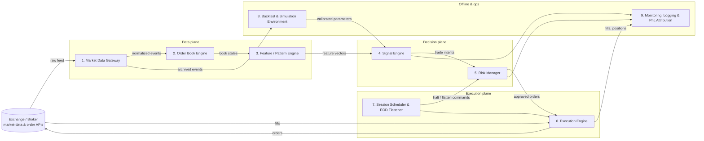

# Intraday Algebraic-Pattern Trading Bot — High-Level Design

## 1. Purpose and scope

An automated **day-trading** system that:

1. Consumes live market data — most importantly the **limit order book** (L2/L3 depth) and the trade tape — for a configurable universe of liquid instruments.
2. Extracts **deep algebraic regularities** ("глубокие алгебраические закономерности") from that data: linear-algebraic and statistical structure in the order book and price series (imbalance operators, low-rank factor decompositions of the book, cointegration relations, spectral features, lead–lag structure).
3. Converts those regularities into trade signals, sizes them under strict risk limits, and executes them.
4. **Never holds a position overnight.** A hard, independent end-of-day flattener guarantees the book is empty before the session close, regardless of what any other component thinks.
5. Measures itself against the market every day (PnL attribution vs. a benchmark).

### 1.1 Return objective — an honest statement

The stated goal is to outperform the market with **up to 100 % annual revenue**. This document treats that number as a *design constraint*, not a promise:

- 100 %/yr ≈ **+0.28 % per trading day** compounded. At realistic intraday hit rates (52–56 %) and payoff ratios, that requires many small trades per day with tight cost control — which is why this design is microstructure-driven (order-book signals decay in seconds-to-minutes and support high trade counts).
- Whether the target is *achieved* depends on the statistical edge actually found in data, fees, slippage, and capital size. **No architecture guarantees returns.** The system is therefore built around a rigorous backtest → paper-trade → small-live pipeline with kill switches, so a lack of edge is discovered cheaply, in simulation, not in the live account.

### 1.2 Out of scope (v1)

- Options, futures spreads, cross-venue arbitrage.
- HFT-grade colocation (< 1 ms). Target reaction time is **10–500 ms** (fast retail/prop tier).
- Machine-learned black boxes. v1 signals are explicit algebraic/statistical constructions so every trade is explainable.

## 2. System overview

All online blocks communicate over an internal **event bus** (in-process queues in v1) with typed, timestamped messages. Every message is also written to an append-only journal so any day can be replayed deterministically.

## 3. Blocks

Each block below states its **responsibility**, **inputs**, and **outputs**. Detailed implementation specs live in `docs/specs/`, one file per block.

---

### Block 1 — Market Data Gateway

**Responsibility.** The only component that talks to external market-data APIs. Subscribes to L2 order-book deltas, trades, and session status; normalizes vendor-specific formats into internal event types; timestamps everything; handles reconnects, gap detection, and snapshot recovery; archives the raw stream.

**Inputs**
- Exchange/broker websocket & REST feeds: book snapshots, book deltas, trade prints, instrument reference data, session calendar.
- Configuration: instrument universe, venue credentials, reconnect policy.

**Outputs**
- `BookSnapshot{instrument, ts_exchange, ts_local, bids[], asks[], seq}`
- `BookDelta{instrument, ts_exchange, ts_local, side, price, size, seq}`
- `TradePrint{instrument, ts_exchange, ts_local, price, size, aggressor_side, seq}`
- `FeedStatus{instrument, state ∈ {LIVE, STALE, GAP, DOWN}, detail}`
- Raw-feed archive files (for Block 8).

---

### Block 2 — Order Book Engine

**Responsibility.** Maintains a full, consistent limit-order-book replica per instrument from snapshots + deltas. Detects sequence gaps and requests re-snapshot. Emits fixed-depth book states at every change and at a regular sampling clock. This is the ground truth every downstream algebraic computation runs on.

**Inputs**
- `BookSnapshot`, `BookDelta`, `TradePrint`, `FeedStatus` from Block 1.

**Outputs**
- `BookState{instrument, ts, bids[N], asks[N], mid, microprice, spread, seq}` — event-driven and sampled (e.g. every 100 ms).
- `BookIntegrity{instrument, ok, crossed_book, staleness_ms}`.

---

### Block 3 — Feature / Pattern Engine

**Responsibility.** The mathematical heart: turns raw book states and trades into a **feature vector** of algebraic regularities. v1 feature families:

- *Imbalance algebra*: multi-level order-flow imbalance (OFI), queue imbalance, depth-weighted imbalance — linear functionals of the book vector.
- *Low-rank structure*: rolling PCA/SVD of the stacked book matrix (levels × time) — factor loadings, residual energy, effective rank.
- *Cross-sectional relations*: cointegration vectors / rolling regressions between related instruments; deviation from the algebraic relation is the signal.
- *Spectral / temporal*: short-window autocorrelation, trend-vs-mean-reversion regime statistic (variance-ratio), realized-volatility estimates.
- *Trade-tape features*: signed volume, VPIN-style toxicity, aggressor imbalance.

All features are **incrementally computable** (O(1) or O(depth) per event) to meet the latency budget.

**Inputs**
- `BookState`, `TradePrint` streams from Block 2.
- Configuration: feature definitions, window lengths, universe groupings for cross-sectional features.

**Outputs**
- `FeatureVector{instrument, ts, features: {name → float}, quality_flags}` at each sampling tick.
- `FeatureStats{name, rolling_mean, rolling_std}` for normalization and drift monitoring (to Block 9).

---

### Block 4 — Signal Engine

**Responsibility.** Maps feature vectors to discrete **trade intents**. v1 is an ensemble of explicit rules calibrated offline by Block 8 (thresholds on normalized features, e.g. "enter long when 5-level OFI z-score > θ and regime statistic favors momentum"). Each intent carries direction, conviction, expected holding horizon, and the features that fired — full explainability. Includes per-signal cooldowns and a no-trade zone around session open/close auctions.

**Inputs**
- `FeatureVector` stream from Block 3.
- Calibrated parameter set (thresholds, weights, horizons) from Block 8.
- `SessionPhase` from Block 7 (to suppress signals near open/close).

**Outputs**
- `TradeIntent{instrument, ts, side, conviction ∈ (0,1], horizon_s, entry_type ∈ {MARKET, LIMIT}, reason: {feature → value}}`
- `SignalHealth{signals_evaluated, suppressed, fired}` (to Block 9).

---

### Block 5 — Risk Manager

**Responsibility.** The only path from a signal to an order. Converts intents into sized orders and enforces *all* limits **pre-trade**: per-instrument and gross position caps, per-trade and daily max loss, order-rate throttles, price-sanity collars, and the **intraday-only** rule (rejects any order that could not be flattened before close). Maintains a real-time position/PnL ledger. Owns the **kill switch**: on daily-loss breach or feed problems it cancels everything and flattens via Block 6.

**Inputs**
- `TradeIntent` from Block 4.
- Fills and order-state updates from Block 6.
- `BookState` (for marking positions) from Block 2.
- `SessionPhase` and flatten commands from Block 7.
- Risk configuration: capital, loss limits, position caps, sizing rules (e.g. conviction-scaled fractional-Kelly with a hard cap).

**Outputs**
- `OrderRequest{instrument, side, qty, type, limit_price?, time_in_force, intent_id}` to Block 6.
- `IntentRejection{intent_id, rule, detail}` (to Block 9).
- `PositionState{instrument, qty, avg_price, realized_pnl, unrealized_pnl}` continuous stream.
- `KillSwitch{reason}` events.

---

### Block 6 — Execution Engine

**Responsibility.** The only component that sends orders to the broker/exchange. Manages the order lifecycle (new → acked → partial → filled/cancelled/rejected), implements execution tactics (passive join, cross after timeout, slippage-capped market), retries idempotently, reconciles positions with the broker, and measures realized slippage per fill.

**Inputs**
- `OrderRequest` and cancel/flatten commands from Block 5 (and Block 7 in emergencies).
- Broker order API responses: acks, fills, rejects.
- `BookState` from Block 2 (for tactic decisions and slippage measurement).

**Outputs**
- Orders to the broker API.
- `Fill{order_id, intent_id, instrument, qty, price, fee, ts}` to Blocks 5 & 9.
- `OrderState{order_id, state, reason?}` to Blocks 5 & 9.
- `ExecutionQuality{intent_id, arrival_mid, avg_fill_price, slippage_bps, latency_ms}` to Block 9.

---

### Block 7 — Session Scheduler & EOD Flattener

**Responsibility.** Owns the trading calendar and the clock. Publishes session phases (PRE_OPEN → OPEN_AUCTION → TRADING → WIND_DOWN → FORCE_FLAT → CLOSED). Enforces the day-trading contract with escalating hard deadlines: at *T−X* min stop new entries, at *T−Y* min flatten passively, at *T−Z* min **market-order everything flat and cancel all**, then verify with the broker that positions are zero. Deliberately simple and independent, so it works even if Signal/Risk blocks are misbehaving.

**Inputs**
- Exchange calendar (holidays, half-days) and configured deadlines.
- Wall clock + feed heartbeat (to detect clock/feed skew).
- `PositionState` from Block 5 and broker position reconciliation from Block 6.

**Outputs**
- `SessionPhase{phase, ts, seconds_to_close}` broadcast.
- `FlattenCommand{mode ∈ {PASSIVE, AGGRESSIVE}, deadline_ts}` to Blocks 5/6.
- `EodReport{flat_confirmed: bool, residual_positions[]}` to Block 9 (a non-flat EOD is a critical alert).

---

### Block 8 — Backtest & Simulation Environment

**Responsibility.** Offline twin of the decision path. Replays archived feed data through Blocks 2–7 *unchanged* (same code, simulated clock and broker), models fees, queue position, and slippage conservatively, and produces the metrics that decide whether a parameter set may go live: net return, Sharpe, max drawdown, hit rate, turnover, capacity. Includes walk-forward calibration (train on window k, validate on k+1) so thresholds in Block 4 are never fit on the data they are judged by. A parameter set is promoted only if it beats the benchmark **after costs** across walk-forward folds.

**Inputs**
- Archived raw feed events from Block 1.
- Candidate strategy parameter sets; cost model configuration.

**Outputs**
- `BacktestReport{params, net_return, sharpe, max_dd, hit_rate, trades/day, capacity_estimate, per-fold results}`.
- Promoted, versioned parameter files consumed by Block 4.

---

### Block 9 — Monitoring, Logging & PnL Attribution

**Responsibility.** Structured logging of every event, real-time dashboard (positions, PnL, feed health, order states, kill-switch status), alerting (feed down, loss-limit approach, EOD not flat, backtest/live divergence), and **daily PnL attribution**: per-signal, per-instrument PnL vs. the benchmark, so "did we over-perform the market today?" has a precise answer every day. Persists everything for compliance and research.

**Inputs**
- Events from every block (journal bus): intents, rejections, fills, positions, execution quality, feature stats, session/EOD reports.
- Benchmark data (index or buy-and-hold reference) from Block 1.

**Outputs**
- Append-only event journal (replayable).
- Daily report: `{net_pnl, benchmark_return, alpha, per_signal_pnl, costs, slippage, risk_events}`.
- Real-time alerts (log/webhook) and dashboard state.

---

## 4. Cross-cutting rules

1. **Determinism & replayability.** Every online decision is a pure function of journaled inputs; any trading day can be replayed bit-for-bit for debugging.
2. **Single-writer rule.** Only Block 1 reads market data; only Block 6 writes orders; only Block 5 sizes risk. No back doors.
3. **Fail-safe direction.** Any component failure degrades toward *flat and halted*, never toward *unmanaged positions*: feed loss → no new orders + flatten; Risk crash → Execution cancels all resting orders; clock skew → force-flat early.
4. **Config as code.** All parameters (universe, thresholds, limits, deadlines) live in versioned config files; a run records the exact config + code revision it used.
5. **Promotion pipeline.** backtest → paper trading (live data, simulated fills) → small live capital → scaled capital. Each stage has explicit go/no-go metrics defined in Block 8's spec.

## 5. Technology assumptions (v1)

- **Language:** Python 3.11+ (NumPy for the linear algebra; the incremental features are O(1) per tick so Python meets the 10–500 ms budget). Hot paths isolated behind interfaces so they can be ported to Rust/C++ later without redesign.
- **Process model:** single process, multiple asyncio tasks + bounded queues (v1); the event-bus abstraction allows splitting into processes later.
- **Storage:** append-only newline-delimited JSON (journal) + Parquet (archives); SQLite for reference data.
- **Broker/venue:** abstracted behind `MarketDataAdapter` / `ExecutionAdapter` interfaces; v1 ships with a paper-trading adapter and one real-broker adapter.

## 6. Spec index

| # | Block | Spec file |
|---|-------|-----------|
| 1 | Market Data Gateway | `docs/specs/01-market-data-gateway.md` |
| 2 | Order Book Engine | `docs/specs/02-order-book-engine.md` |
| 3 | Feature / Pattern Engine | `docs/specs/03-feature-pattern-engine.md` |
| 4 | Signal Engine | `docs/specs/04-signal-engine.md` |
| 5 | Risk Manager | `docs/specs/05-risk-manager.md` |
| 6 | Execution Engine | `docs/specs/06-execution-engine.md` |
| 7 | Session Scheduler & EOD Flattener | `docs/specs/07-session-scheduler-eod-flattener.md` |
| 8 | Backtest & Simulation Environment | `docs/specs/08-backtest-simulation.md` |
| 9 | Monitoring, Logging & PnL Attribution | `docs/specs/09-monitoring-pnl-attribution.md` |
